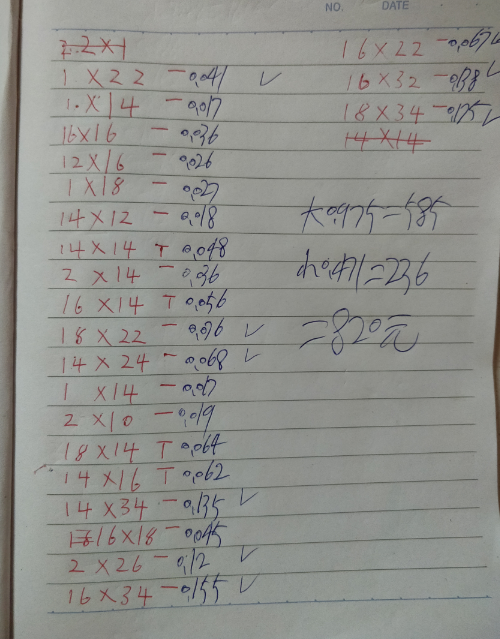
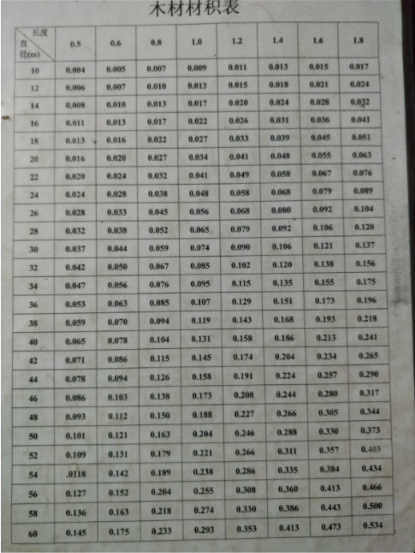
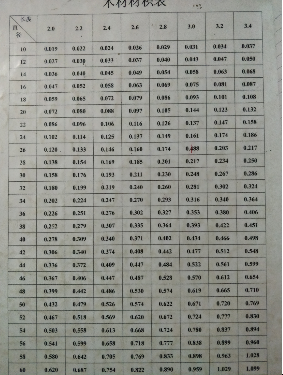

# wood-volume-calculator
>这是一个简化木工计算木头的计算器
web技术发展迅速，敏捷，发现身边没有好的一款为木头测量的计算器,要不就是太丑，要不就是不够便捷，要不就是不够灵活，实习期间学了点vue
就当拿来练手

技术采用`vue2.x + element ui `框架 实现 
制作的初衷为了我父亲做的，让他在测量后计算价格方便，程序标准是依照我父亲标准设定的，
如果制作有偏差，设计有缺陷，中肯的改进都可以和我联系，我好改进

## 计算器链接
https://breakon.github.io/wood-volume-calculator/index

安装
## Build Setup

``` bash
# install dependencies
npm install

# serve with hot reload at localhost:8080
npm run dev

# build for production with minification
npm run build

# build for production and view the bundle analyzer report
npm run build --report

# run unit tests
npm run unit

# run all tests
npm test
``` 

## 产品展示


`依照这3张数据来制定的`





### 使用

点击中间就是开始计算，计算结果保留3为小数，计算结果由3个公式控制 

